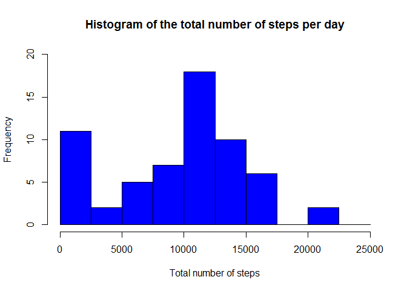
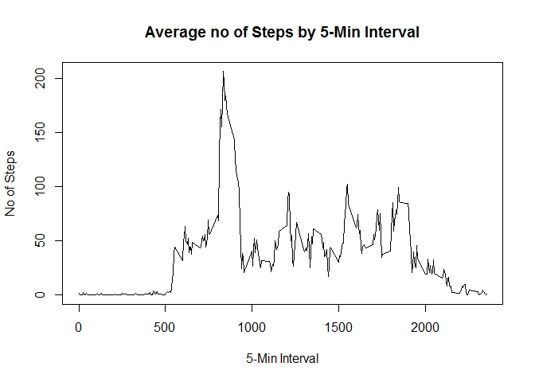

# Reproducible Research: Peer Assessment 1

## Loading and preprocessing the data

```r
library(stats)
data = read.csv("C://Users/Tommy/Documents/Project/Represearch_week2/activity.csv", header = TRUE, sep = ",", colClasses=c("numeric", "character", "numeric"))
```

## What is mean total number of steps taken per day?

```r
# Compute the total number of steps each day (NA values removed)
sum_data <- aggregate(data$steps, by=list(data$date), FUN=sum, na.rm=TRUE)

# Rename the attributes
names(sum_data) <- c("date", "total")
head(sum_data)
```

```
##         date total
## 1 2012-10-01     0
## 2 2012-10-02   126
## 3 2012-10-03 11352
## 4 2012-10-04 12116
## 5 2012-10-05 13294
## 6 2012-10-06 15420
```

```r
hist(sum_data$total, 
     breaks=seq(from=0, to=25000, by=2500),
     col="blue", 
     xlab="Total number of steps", 
     ylim=c(0, 20), 
     main="Histogram of the total number of steps per day")
```

<!-- -->


## What is the average daily activity pattern?

```r
meanInterval = aggregate( steps~interval, data, mean)
plot(meanInterval$interval, meanInterval$steps, type = "l", xlab="5-Min Interval",
main = "Average no of Steps by 5-Min Interval", ylab="No of Steps")
```

<!-- -->

```r
maxIntervalInterval = which.max(meanInterval$interval)
maxSteps = round(max(meanInterval$steps),1)
maxInterval = meanInterval$interval[which.max(meanInterval$steps)] 
```
## Inputing missing values

```r
missingValues = format(sum(is.na(data$steps)),big.mark=',') 

stepAdjust = vector()
	for (item in data$steps) {
        if (is.na(item)) { # if a step figure is missing...
                stepAdjust = append(stepAdjust, mean(data$steps, na.rm = TRUE)) # return the mean 
        } else {
                stepAdjust = append(stepAdjust, item)
        }        
	}

dataFull = data
dataFull$steps = stepAdjust

stepsperday2 = aggregate(steps ~ date, data = dataFull, sum)
hist(stepsperday2$steps, main="No of Steps per Day (Adjusted)", xlab="Total No of Steps")
```

<!-- -->

```r
newMean = format(mean(stepsperday2$steps, na.rm = TRUE),scientific=FALSE, big.mark=',') 
newMedian = format(median(stepsperday2$steps, na.rm = TRUE),scientific=FALSE, big.mark=',')
```
## Are there differences in activity patterns between weekdays and weekends?

```r
daytype <- function(date) {
    if (weekdays(as.Date(date)) %in% c("Saturday", "Sunday")) {
        "weekend"
    } else {
        "weekday"
    }
}
data$daytype <- as.factor(sapply(data$date, daytype))

par(mfrow = c(2, 1))
for (type in c("weekend", "weekday")) {
    steps.type <- aggregate(steps ~ interval, data = data, subset = data$daytype == 
        type, FUN = mean)
    plot(steps.type, type = "l", main = type)
}
```

<!-- -->
